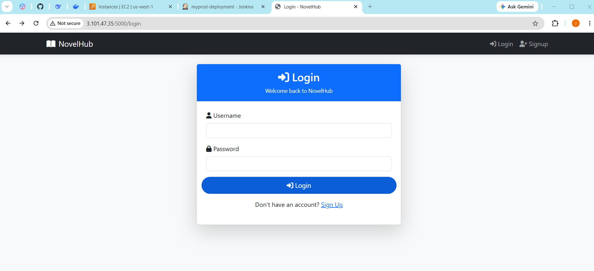
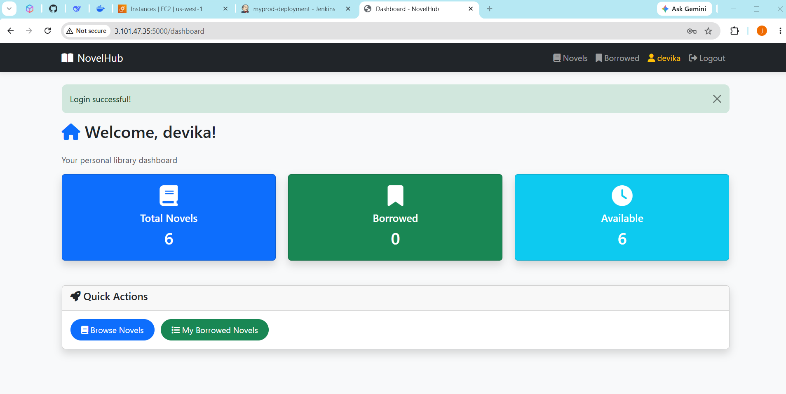
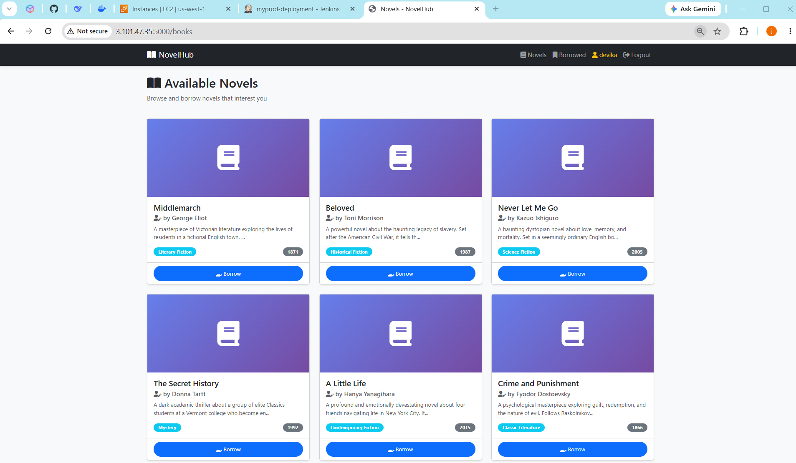
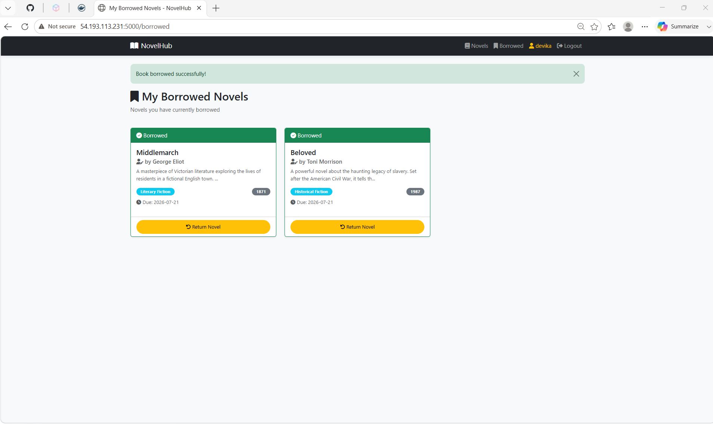
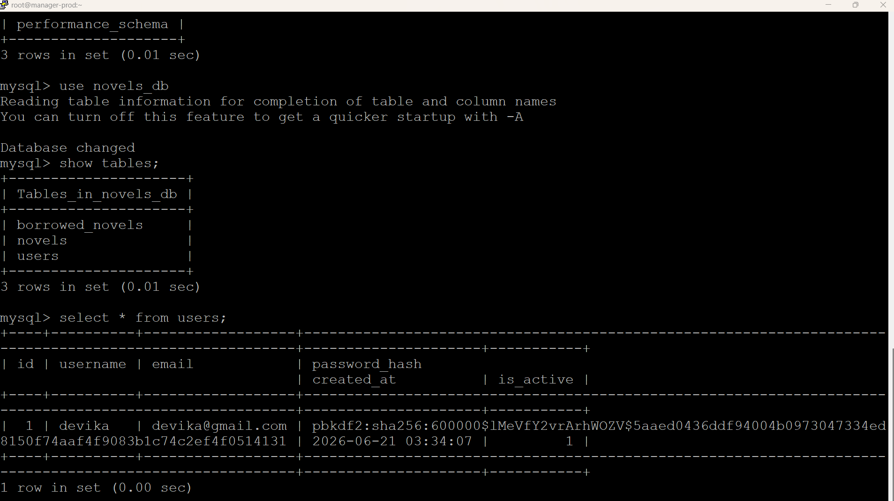
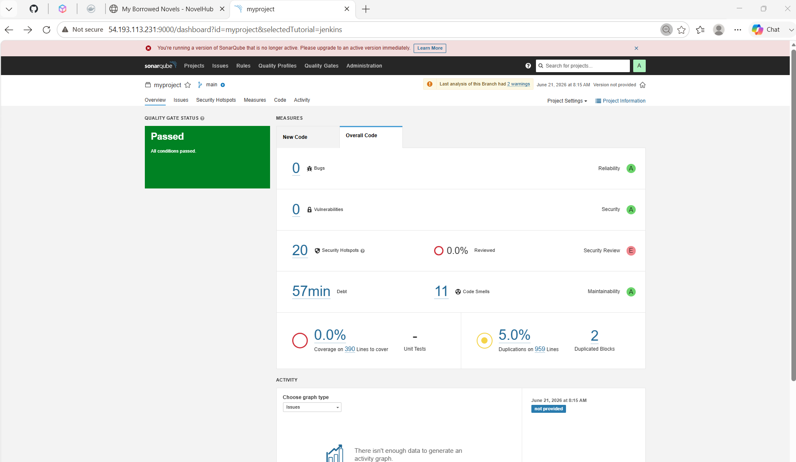
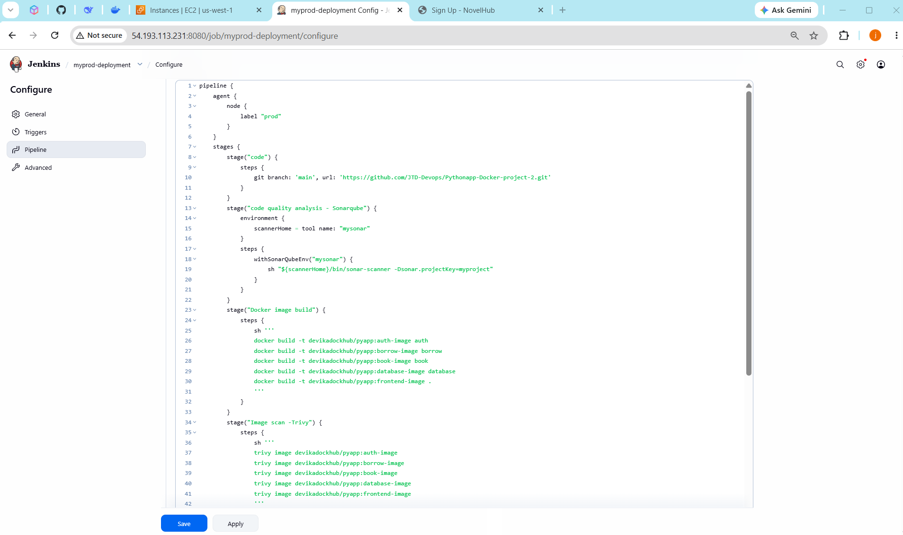

# 📚 NovelHub | Python DevOps Project

> A full-stack Python web application — a digital novel library — deployed using a production-grade DevOps pipeline with Docker Swarm, Jenkins CI/CD, SonarQube code quality analysis, Trivy image scanning, MySQL, and Docker Hub. Users can browse, borrow, and return novels with real-time availability tracking.

---

## 🏗️ Architecture Overview

```
GitHub (main) → Jenkins CI/CD → SonarQube (QA) → Docker Build (5 images) → Trivy Scan → Docker Hub → Docker Stack Deploy (Prod EC2)
```

**Microservices (Docker Services):**
- `auth-image` — User authentication service
- `borrow-image` — Novel borrowing/returning logic
- `book-image` — Novel listing service
- `database-image` — MySQL database container
- `frontend-image` — Flask/HTML frontend

---

## 🛠️ Tech Stack

| Layer | Technology |
|---|---|
| **Backend** | Python (Flask) |
| **Database** | MySQL (`novels_db`) |
| **Containerization** | Docker, Docker Swarm (Stack) |
| **CI/CD** | Jenkins (Declarative Pipeline) |
| **Code Quality** | SonarQube |
| **Image Security** | Trivy |
| **Registry** | Docker Hub (`devikadockhub/pyapp`) |
| **Infrastructure** | AWS EC2 (us-west-1) |
| **Orchestration** | Docker Stack (`compose.yml`) |

---

## 📊 Real Metrics Achieved

### 🔍 SonarQube Code Quality
> Project: `myproject` · Branch: `main` · Analysed: **June 21, 2026 at 8:15 AM**

| Metric | Value | Rating |
|---|---|---|
| **Quality Gate Status** | ✅ Passed — All conditions met | — |
| **Bugs** | 0 | 🟢 A |
| **Vulnerabilities** | 0 | 🟢 A |
| **Security Hotspots** | 20 (0.0% reviewed) | 🔴 E |
| **Technical Debt** | 57 min | 🟢 A |
| **Code Smells** | 11 | 🟢 A |
| **Code Coverage** | 0.0% | — |
| **Lines to Cover** | 390 | — |
| **Unit Tests** | 0 | — |
| **Duplications** | 5.0% on 959 lines | 🟡 — |
| **Duplicated Blocks** | 2 | — |

---

### 🐳 Docker Hub Registry (`devikadockhub/pyapp`)

| Metric | Value |
|---|---|
| **Total Images Built & Pushed** | 5 |
| **Image Tags** | `auth-image`, `borrow-image`, `book-image`, `database-image`, `frontend-image` |
| **Stack Name** | `novelszone` |
| **Compose File** | `compose.yml` |

---

### 🗄️ MySQL Live Database Metrics

| Metric | Value |
|---|---|
| **Database Engine** | MySQL |
| **Database Name** | `novels_db` |
| **Total Tables** | 3 (`users`, `novels`, `borrowed_novels`) |
| **Total Users** | 1 |
| **Username** | `devika` |
| **Email** | `devika@gmail.com` |
| **Password Algorithm** | PBKDF2:SHA256 — 600,000 rounds |
| **Account Created** | 2026-06-21 03:34:07 |
| **Account Active** | `1` (true) |
| **Total Novels Seeded** | 6 |
| **Borrow Due Date Window** | 30 days (due: 2026-07-21) |

---

### 📚 Novels Seeded in Database — All 6

| # | Title | Author | Genre | Year |
|---|---|---|---|---|
| 1 | Middlemarch | George Eliot | Literary Fiction | 1871 |
| 2 | Beloved | Toni Morrison | Historical Fiction | 1987 |
| 3 | Never Let Me Go | Kazuo Ishiguro | Science Fiction | 2005 |
| 4 | The Secret History | Donna Tartt | Mystery | 1992 |
| 5 | A Little Life | Hanya Yanagihara | Contemporary Fiction | 2015 |
| 6 | Crime and Punishment | Fyodor Dostoevsky | Classic Literature | 1866 |

---

### 🖥️ AWS EC2 Infrastructure

| Metric | Value |
|---|---|
| **Region** | us-west-1 |
| **App Instance IP** | 3.101.47.35 |
| **Jenkins/SonarQube Instance IP** | 54.193.113.231 |
| **App Port** | 5000 |
| **Jenkins Port** | 8080 |
| **SonarQube Port** | 9000 |
| **Jenkins Job Name** | `myprod-deployment` |
| **Jenkins Agent Label** | `prod` |

---

### 📈 Application Metrics (NovelHub)

| Metric | Value |
|---|---|
| **Total Novels** | 6 |
| **Borrowed (active session)** | 2 (Middlemarch + Beloved) |
| **Available** | 6 (fresh session) |
| **Borrow Due Date** | 2026-07-21 (30 days from borrow) |
| **Logged-in User** | devika |

---

### 🔧 Jenkins Pipeline Details

| Metric | Value |
|---|---|
| **Pipeline Name** | `myprod-deployment` |
| **Pipeline Type** | Declarative (Groovy) |
| **Total Stages** | 6 |
| **Source Branch** | `main` |
| **GitHub Repo** | `JTD-Devops/Pythonapp-Docker-project-2` |
| **SonarQube Tool Name** | `mysonar` |
| **SonarQube Project Key** | `myproject` |
| **Docker Registry Credential ID** | `ffd04b48-c2fe-4f15-94a3-f1e1b7627f64` |
| **Stack Name** | `novelszone` |
| **Compose File** | `compose.yml` |

---

## 🔄 CI/CD Pipeline Stages (Jenkins)

```
code → code quality analysis - Sonarqube → Docker image build → Image scan - Trivy → Docker Registy → deploying the app using docker stack
```

---

## 🚀 NovelHub Application

### 📸 Screenshots

**Login Page**
> 📎 `Loginpage-Novelhub.png` already uploaded ✅
> 🔗 To replace: [Upload to repo](https://github.com/JTD-Devops/Pythonapp-Docker-project-2/upload/main)



---

**Dashboard / Homepage**
> 📎 `Homepage-Novelhub.png` already uploaded ✅
> 🔗 To replace: [Upload to repo](https://github.com/JTD-Devops/Pythonapp-Docker-project-2/upload/main)



---

**Available Novels**
> 📎 `availablenovels-Novelhub.png` already uploaded ✅
> 🔗 To replace: [Upload to repo](https://github.com/JTD-Devops/Pythonapp-Docker-project-2/upload/main)



---

**My Borrowed Novels**
> 📎 `Borrowednovels-Novelhub.png` already uploaded ✅
> 🔗 To replace: [Upload to repo](https://github.com/JTD-Devops/Pythonapp-Docker-project-2/upload/main)



---

**MySQL — Database Tables & Users**
> 📎 `Database-Novelhub.png` already uploaded ✅
> 🔗 To replace: [Upload to repo](https://github.com/JTD-Devops/Pythonapp-Docker-project-2/upload/main)



---

## 🔍 SonarQube Code Quality Report

> 📎 `Sonarqube.png` already uploaded ✅
> 🔗 To replace: [Upload to repo](https://github.com/JTD-Devops/Pythonapp-Docker-project-2/upload/main)



- **Quality Gate: PASSED ✅**
- Project: `myproject` | Branch: `main` | Analysed: June 21, 2026 at 8:15 AM
- Reliability: **A** | Security: **A** | Maintainability: **A** | Security Review: **E**
- 0 Bugs | 0 Vulnerabilities | 11 Code Smells | 57 min Debt | 20 Security Hotspots
- Coverage: 0.0% on 390 lines | Duplications: 5.0% on 959 lines | 2 Duplicated Blocks

---

## 🧾 Jenkins Pipeline Script

> 📎 `Jenkinspipeline-1.png` already uploaded ✅
> 🔗 To replace: [Upload to repo](https://github.com/JTD-Devops/Pythonapp-Docker-project-2/upload/main)



> 📎 `Jenkinspipeline-2.png` already uploaded ✅
> 🔗 To replace: [Upload to repo](https://github.com/JTD-Devops/Pythonapp-Docker-project-2/upload/main)


```groovy
pipeline {
    agent {
        node {
            label "prod"
        }
    }
    stages {
        stage("code") {
            steps {
                git branch: 'main', url: 'https://github.com/JTD-Devops/Pythonapp-Docker-project-2.git'
            }
        }
        stage("code quality analysis - Sonarqube") {
            environment {
                scannerHome = tool name: "mysonar"
            }
            steps {
                withSonarQubeEnv("mysonar") {
                    sh "${scannerHome}/bin/sonar-scanner -Dsonar.projectKey=myproject"
                }
            }
        }
        stage("Docker image build") {
            steps {
                sh '''
                docker build -t devikadockhub/pyapp:auth-image auth
                docker build -t devikadockhub/pyapp:borrow-image borrow
                docker build -t devikadockhub/pyapp:book-image book
                docker build -t devikadockhub/pyapp:database-image database
                docker build -t devikadockhub/pyapp:frontend-image .
                '''
            }
        }
        stage("Image scan -Trivy") {
            steps {
                sh '''
                trivy image devikadockhub/pyapp:auth-image
                trivy image devikadockhub/pyapp:borrow-image
                trivy image devikadockhub/pyapp:book-image
                trivy image devikadockhub/pyapp:database-image
                trivy image devikadockhub/pyapp:frontend-image
                '''
            }
        }
        stage("Docker Registy") {
            steps {
                withDockerRegistry(credentialsId: 'ffd04b48-c2fe-4f15-94a3-f1e1b7627f64') {
                    sh '''
                    docker push devikadockhub/pyapp:auth-image
                    docker push devikadockhub/pyapp:borrow-image
                    docker push devikadockhub/pyapp:book-image
                    docker push devikadockhub/pyapp:database-image
                    docker push devikadockhub/pyapp:frontend-image
                    '''
                }
            }
        }
        stage("deploying the app using docker stack") {
            steps {
                sh "docker stack deploy -c compose.yml novelszone"
            }
        }
    }
}
```

---

## 🗄️ Database Schema (MySQL)

```sql
-- Switch to database
USE novels_db;

-- Show all tables
SHOW TABLES;
-- Tables: borrowed_novels | novels | users

-- Users table
SELECT * FROM users;
-- id | username | email | password_hash | created_at | is_active

-- Novels table
SELECT * FROM novels;
-- id | title | author | description | genre | year | is_borrowed | borrowed_by | created_at

-- Borrowed novels table
SELECT * FROM borrowed_novels;
-- id | user_id | novel_id | borrowed_at | returned_at | status | due_date
```

**Live data verified via MySQL CLI inside the database container:**
- User `devika` — `devika@gmail.com` — PBKDF2:SHA256 (600,000 rounds) — created `2026-06-21 03:34:07`
- 6 novels seeded across genres: Literary Fiction, Historical Fiction, Science Fiction, Mystery, Contemporary Fiction, Classic Literature
- Borrow records with `due_date` auto-set to 30 days from borrow timestamp (2026-07-21)

---

## 📂 Project Structure

```
Pythonapp-Docker-project-2/
├── auth/               # Authentication microservice
├── borrow/             # Borrow/return microservice
├── book/               # Novel listing microservice
├── database/           # MySQL container config & seed data
├── compose.yml         # Docker Stack compose file
├── Dockerfile          # Frontend image build
└── sonar-project.properties
```

---

## ▶️ How to Run Locally

```bash
# Clone the repository
git clone https://github.com/JTD-Devops/Pythonapp-Docker-project-2.git
cd Pythonapp-Docker-project-2

# Initialize Docker Swarm (if not already)
docker swarm init

# Deploy the stack
docker stack deploy -c compose.yml novelszone

# Access the app
open http://localhost:5000
```

---

## 🧠 Experience & Skills Gained

### DevOps & CI/CD
- Built a **6-stage Jenkins declarative pipeline** from scratch — code checkout, SonarQube QA, Docker build, Trivy scan, Docker Hub push, and Docker Stack deploy
- Configured **SonarQube** (`mysonar` tool, `myproject` key) and integrated it via `withSonarQubeEnv` in Jenkins
- Used **Trivy** to vulnerability-scan all 5 microservice images (`auth-image`, `borrow-image`, `book-image`, `database-image`, `frontend-image`) before pushing to registry
- Managed Docker Hub credentials securely in Jenkins via `withDockerRegistry` and credential UUID

### Docker & Orchestration
- Designed a **5-service microservices architecture** containerised across separate Docker images
- Deployed to production using **Docker Stack** (`docker stack deploy -c compose.yml novelszone`) on AWS EC2
- Understood Docker **image tagging conventions** (`devikadockhub/pyapp:<tag>`), Swarm networking, and service isolation

### Application Development
- Built a Python/Flask web app with **user authentication**, **session management**, and **novel borrow/return logic**
- Designed and queried a **MySQL relational schema** with `users`, `novels`, and `borrowed_novels` tables
- Verified live data directly via MySQL CLI inside the container — confirming password hashing (PBKDF2:SHA256:600000), borrow timestamps, and due dates
- Seeded **6 classic novels** across diverse genres spanning 1866–2015

### Infrastructure & AWS
- Deployed across **AWS EC2 (us-west-1)** — separate instances for the app (`3.101.47.35`) and Jenkins/SonarQube (`54.193.113.231`)
- Configured security groups to expose ports: 5000 (app), 8080 (Jenkins), 9000 (SonarQube)

### Code Quality Awareness
- Achieved **SonarQube Quality Gate: PASSED** with 0 bugs and 0 vulnerabilities
- Identified 20 security hotspots and 11 code smells as technical debt items for future improvement
- Measured code duplication at 5.0% across 959 lines — a real baseline metric to track going forward


## 👤 Author

**Juttu Devika** | Associate-DevOps

Built with 🐍 Python · 🐳 Docker · ⚙️ Jenkins · 🔍 SonarQube · 🛡️ Trivy · 🐬 MySQL · ☁️ AWS EC2
